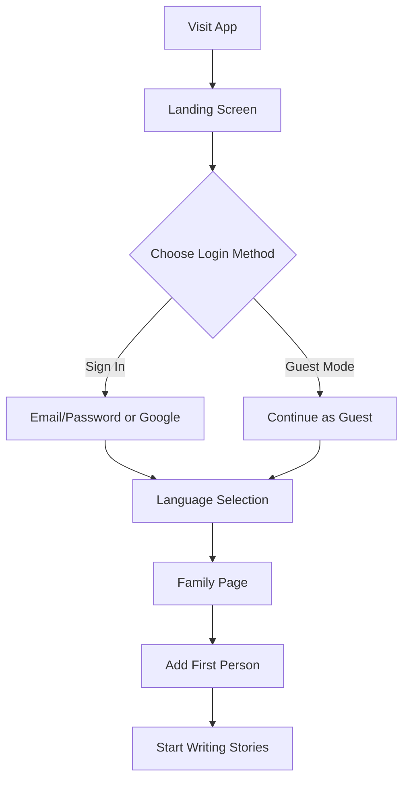
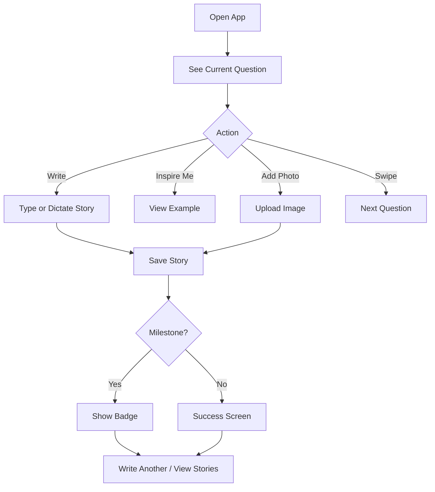

# VitaMyStory - Complete App Documentation

> **A digital sanctuary for preserving family memories and stories**

---

## 📖 Table of Contents

1. [Overview](#overview)
2. [Core Concept](#core-concept)
3. [Tech Stack](#tech-stack)
4. [App Architecture](#app-architecture)
5. [Key Features](#key-features)
6. [User Flow](#user-flow)
7. [Data Management](#data-management)
8. [Localization](#localization)
9. [Authentication](#authentication)
10. [Deployment](#deployment)
11. [How to Use](#how-to-use)

---

## Overview

**VitaMyStory** is a mobile-first Progressive Web App (PWA) designed to help families preserve their legacy by capturing and storing memories about loved ones. It replaces the intimidating "blank page" with guided questions, making storytelling effortless and meaningful.

### Project Details
- **Name**: vms-mini-app (VitaMyStory Memory)
- **Platform**: Web (Next.js 14 with PWA capabilities)
- **Version**: Alpha 1.0
- **Production URL**: https://vms-memory.vercel.app/
- **Languages**: English & Spanish

---

## Core Concept

### Mission
> "Preserving the human voice before it fades."

VitaMyStory is more than an app—it's a companion that helps you:
- **Capture** memories that would otherwise be lost
- **Preserve** stories for future generations
- **Share** family legacy with loved ones

### Design Philosophy
- **Warm & Patient**: Feels like a quiet Sunday afternoon with a loved one
- **Timeless**: Clean, editorial design with serif typography (Libre Baskerville)
- **Breathing Room**: No clutter, no urgency—every interaction feels intentional
- **Premium Feel**: Modern spacing, airy layouts, and thoughtful animations

### Target Audience
1. **The Storytellers**: Elders who want to leave something behind
2. **The Curators**: Adult children capturing their parents' legacy
3. **The Future**: Grandchildren who will need to know where they came from

---

## Tech Stack

### Frontend
- **Framework**: Next.js 14.2.5 (App Router)
- **UI Library**: React 18.3.1
- **Language**: TypeScript
- **Styling**: Tailwind CSS
- **Animations**: Framer Motion

### Backend & Services
- **Authentication**: Firebase Auth (Email/Password + Google Sign-In)
- **Database**: Firebase Firestore (cloud sync)
- **Storage**: Firebase Storage (image uploads)
- **AI**: Google Generative AI (story refinement)

### Additional Features
- **PWA**: next-pwa (offline support, installable)
- **Voice Input**: Web Speech API (dictation)
- **Image Processing**: html-to-image (share cards)
- **Icons**: React Icons

---

## App Architecture

```
vms-memory/
├── app/
│   ├── components/          # Reusable UI components
│   │   ├── LandingScreen.tsx    # Onboarding/auth screen
│   │   ├── AuthForm.tsx         # Login/signup forms
│   │   ├── StoryCarousel.tsx    # Story viewing interface
│   │   ├── RefineModal.tsx      # AI story refinement
│   │   ├── BottomNav.tsx        # Navigation bar
│   │   └── ...
│   │
│   ├── context/             # Global state management
│   │   └── MemoryContext.tsx    # Main app state & logic
│   │
│   ├── hooks/               # Custom React hooks
│   │   ├── useAuth.ts           # Firebase authentication
│   │   ├── useSync.ts           # Cloud/local sync
│   │   ├── useDictation.ts      # Voice input
│   │   └── useSwipe.ts          # Swipe gestures
│   │
│   ├── utils/               # Helper functions
│   │   ├── index.ts             # Core utilities
│   │   ├── storage.ts           # Firebase storage
│   │   ├── ai.ts                # AI integration
│   │   ├── haptics.ts           # Haptic feedback
│   │   └── text.tsx             # Text formatting
│   │
│   ├── lib/                 # External services
│   │   └── firebase.ts          # Firebase config
│   │
│   ├── constants/           # App constants
│   │   └── index.ts             # Translations, questions
│   │
│   ├── types/               # TypeScript types
│   │   └── index.ts
│   │
│   ├── page.tsx             # Main story writing page
│   ├── layout.tsx           # Root layout
│   │
│   ├── family/              # Family members page
│   ├── stories/             # Stories listing page
│   ├── profile/             # User profile & settings
│   ├── notifications/       # Notifications page
│   └── story/[id]/          # Individual story view
│
├── public/                  # Static assets
│   ├── manifest.json
│   ├── icons/
│   └── ...
│
└── next.config.js          # Next.js + PWA config
```

---

## Key Features

### 1. 🎯 Guided Story Prompts

The app provides **5 core questions** to make storytelling easier:

1. "What's the first memory that comes to mind when you think of them?"
2. "What's something you want everyone to know about them?"
3. "What were they known for?"
4. "In one word, how would you describe this person?"
5. "What do you think mattered most to them?"

After completing starter questions, users can write **freeform stories**.

#### Question System Features:
- **Context-Aware**: Questions personalize with the person's name (e.g., "What is something **Grandma Elvia** was known for?")
- **Progress Tracking**: Shows "Chapter X of 5"
- **Navigation**: Swipe or arrow buttons to switch questions
- **Inspiration**: "Inspire Me" button shows example answers
- **Used Question Tracking**: Never shows the same question twice

### 2. ✍️ Rich Story Creation

#### Input Methods:
- **Text Writing**: Beautiful serif text editor
- **Voice Dictation**: Speech-to-text for hands-free storytelling
- **Photo Upload**: Add images to stories (compressed automatically)
- **Photo-Only Stories**: Share memories without words

#### Writing Experience:
- Minimalist, distraction-free editor
- Draft auto-save (never lose progress)
- Edit saved stories anytime
- Image preview with gradient overlay

### 3. 🤖 AI Story Refinement

Powered by **Google Generative AI**:
- Refine and enhance your stories
- Maintains your original voice and meaning
- Optional feature (appears after writing 20+ characters)
- Beautiful animated button with ✨ sparkle icon

### 4. 🏆 Gamification & Milestones

#### Story Keeper Badge
- Unlocked after saving **5 stories** for a person
- Notification celebration
- Visual badge indicator

#### Progress System:
- Track stories saved per person
- Chapter completion progress
- Visual feedback on achievements

### 5. 🔔 Notifications System

Real-time notifications for:
- Welcome message (first visit)
- Story saved confirmation
- Person created
- Milestone achievements (Story Keeper badge)
- Story downloads (when shared)

**Features**:
- Localized notifications (EN/ES)
- Mark as read/unread
- Delete notifications
- Toast popups for immediate feedback

### 6. 👥 Multi-Person Support

Organize stories by person:
- Create multiple family members
- Switch between people seamlessly
- Each person has their own story collection
- Track progress independently

### 7. 🌍 Bilingual Support

Full localization for:
- **English (EN)**
- **Spanish (ES)**

**What's translated**:
- All UI text
- Story prompts
- Notifications
- Example inspirations
- Error messages

### 8. 🎨 Dark Mode

- Auto-detects system preference
- Manual toggle in profile
- Smooth transitions
- Premium dark color palette

### 9. 📤 Sharing & Export

#### Share Stories:
- Individual story links
- Beautiful share cards with branding
- Native share sheet integration

#### Data Export:
- Download JSON backup of all data
- Includes stories, people, timestamps
- Cloud sync for authenticated users

---

## User Flow

### First-Time User Experience



### Daily Story Creation Flow



---

## Data Management

### Storage Strategy

The app uses a **hybrid storage approach**:

#### 1. **Local Storage** (Default for Guest Users)
- **Location**: Browser `localStorage`
- **Data Stored**:
  - People (name, ID, creation date)
  - Stories (text, images, prompts, timestamps)
  - Drafts (auto-saved writing)
  - Settings (language, theme)
  - Notifications
  - Used question indexes

#### 2. **Cloud Storage** (For Authenticated Users)
- **Firebase Firestore**: Story data, people, metadata
- **Firebase Storage**: Full-resolution images
- **Auto-Sync**: Changes sync automatically across devices

### Data Structure

```typescript
// Person
{
  id: string;
  name: string;
  memories: MemoryItem[];
  createdAt: number;
}

// Memory/Story
{
  id: string;
  text: string;
  prompt: string;
  questionId?: string;  // e.g., "q_0", "q_1", "free"
  imageUrl?: string;
  when?: string;        // Optional date context
  createdAt: number;
  updatedAt?: number;
}

// Notification
{
  id: string;
  title: string;
  message: string;
  type: 'info' | 'success' | 'feature' | 'error';
  date: number;
  read: boolean;
  translationData?: {
    titleKey?: string;
    bodyKey?: string;
    params?: any;
  };
}
```

### Draft Auto-Save

Drafts are saved **every 350ms** as you type:

```
Key format: vms_draft_{personId}_{questionKey}
Example: vms_draft_abc123_q_2
```

This ensures you never lose progress when switching between questions or navigating away.

---

## Localization

### Translation System

All text is centralized in `app/constants/index.ts`:

```typescript
export const TEXT = {
  en: {
    welcomeTitle: "VitaMyStory",
    saveStory: "Save this memory",
    // ... 100+ strings
  },
  es: {
    welcomeTitle: "VitaMyStory",
    saveStory: "Guardar recuerdo",
    // ... 100+ strings
  }
};
```

### Dynamic Name Injection

Questions personalize with the subject's name:

```typescript
// Input: "What were they known for?"
// Output: "What is something Grandma Elvia was known for?"
```

The `|||{name}|||` markers indicate where names should be bolded in the UI.

### Notification Localization

Notifications store both the rendered text AND translation keys:

```typescript
addNotification(
  t.notificationWelcomeTitle,  // Rendered in current language
  t.notificationWelcomeBody,
  "success",
  {
    titleKey: "notificationWelcomeTitle",  // For re-translation
    bodyKey: "notificationWelcomeBody",
    params: { name: "Grandma" }  // Dynamic values
  }
);
```

When the user changes language, notifications re-render in the new language!

---

## Authentication

### Firebase Auth Integration

#### Supported Methods:
1. **Email/Password**: Traditional signup
2. **Google Sign-In**: OAuth via popup
3. **Guest Mode**: No account required (local storage only)

#### Auth States:
- **Unauthenticated**: See landing screen
- **Guest**: Full app access, data stored locally
- **Authenticated**: Cloud sync enabled, data backed up

### Authorized Domains (Firebase Console)

To enable Google Sign-In, these domains are whitelisted:

- `localhost` (local development)
- `vitamystory-77485.firebaseapp.com` (Firebase hosting)
- `vitamystory-77485.web.app` (Firebase web app)
- `vms-memory.vercel.app` (Production)
- Preview deployment URLs (as needed)

### Key Security Features:
- Firebase Security Rules protect user data
- Users can only access their own stories
- Guest data remains client-side only

---

## Deployment

### Vercel Deployment

#### Production URL:
**https://vms-memory.vercel.app/**

#### Deployment Process:
1. Push code to Git repository
2. Vercel auto-builds and deploys
3. Environment variables configured in Vercel dashboard

### Environment Variables

Required in `.env.local`:

```bash
# Firebase Configuration
NEXT_PUBLIC_FIREBASE_API_KEY=your_api_key
NEXT_PUBLIC_FIREBASE_AUTH_DOMAIN=your_auth_domain
NEXT_PUBLIC_FIREBASE_PROJECT_ID=your_project_id
NEXT_PUBLIC_FIREBASE_STORAGE_BUCKET=your_storage_bucket
NEXT_PUBLIC_FIREBASE_MESSAGING_SENDER_ID=your_sender_id
NEXT_PUBLIC_FIREBASE_APP_ID=your_app_id
NEXT_PUBLIC_FIREBASE_MEASUREMENT_ID=your_measurement_id

# Google AI (for story refinement)
NEXT_PUBLIC_GEMINI_API_KEY=your_gemini_key
```

### PWA Features

The app is installable as a PWA:
- **Offline support**: Service worker caching
- **Add to Home Screen**: Native app-like experience
- **Push notifications** (planned feature)

---

## How to Use

### For Developers

#### 1. **Install Dependencies**
```bash
npm install
```

#### 2. **Set Up Environment**
Create `.env.local` with Firebase credentials

#### 3. **Run Development Server**
```bash
npm run dev
```
Open http://localhost:3000

#### 4. **Build for Production**
```bash
npm run build
npm run start
```

### For End Users

#### Getting Started:
1. **Visit**: https://vms-memory.vercel.app/
2. **Choose**: Sign in with Google, email, or continue as guest
3. **Select Language**: English or Español
4. **Add a Person**: Enter a family member's name
5. **Start Writing**: Follow the guided prompts
6. **Save & Share**: Preserve your memories forever

#### Tips:
- Use **voice dictation** for easier input
- Click **"Inspire Me"** if you're stuck
- **Swipe** or use arrows to change questions
- **Upload photos** to enhance stories
- **Refine with AI** to polish your writing
- **Download backups** regularly (in Profile)

---

## Feature Highlights

### ✨ Recent Additions (Feb 2026)

1. **AI Story Refinement** (Google Gemini)
   - Animated "Refine Story" button
   - Maintains your voice while improving clarity
   - Optional accept/reject workflow

2. **Localized Notifications**
   - Notifications change language when you switch
   - Translation keys stored with notifications
   - Dynamic parameter injection

3. **Dark Mode**
   - Smooth theme transitions
   - Premium dark color palette
   - Auto-sync across the app

4. **Enhanced Image Support**
   - Image compression before upload
   - Firebase Storage integration
   - Photo-only stories

5. **Toast System**
   - Real-time feedback for actions
   - Auto-dismissing notifications
   - Beautiful animations

---

## Troubleshooting

### Common Issues

#### 1. **Google Sign-In Error: "unauthorized-domain"**
**Solution**: Add your domain to Firebase Console → Authentication → Authorized domains

#### 2. **Stories Not Syncing**
**Solution**: Ensure you're logged in (not in guest mode) and have internet connection

#### 3. **Images Not Uploading**
**Solution**: Check Firebase Storage rules and ensure you're authenticated

#### 4. **Draft Not Saving**
**Solution**: Ensure localStorage is enabled in your browser

---

## Future Enhancements (Roadmap)

- 📱 Native mobile apps (iOS/Android)
- 🎤 Audio story recording
- 📹 Video memory support
- 👨‍👩‍👧‍👦 Family collaboration (multiple users per person)
- 📧 Email reminders to write stories
- 🎨 Custom themes and branding
- 📊 Timeline visualization of memories
- 🔗 Genealogy tree integration

---

## Summary

**VitaMyStory** is a thoughtfully designed app that makes preserving family memories simple, beautiful, and meaningful. By combining guided prompts, multiple input methods, AI assistance, and cloud storage, it removes barriers to storytelling and helps families create lasting legacies.

Whether you're capturing your grandmother's stories, documenting your father's wisdom, or preserving your own memories for future generations, VitaMyStory provides the perfect sanctuary for these precious moments.

---

**Version**: Alpha 1.0 (Last Updated: Feb 12, 2026)
